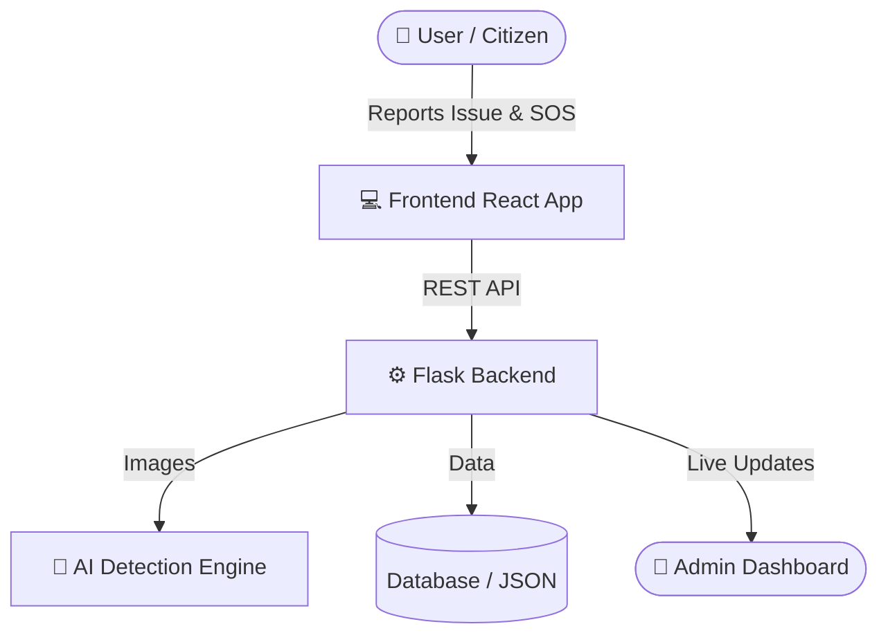

<div align="center">

# 🛡️ RAKSHA AI

**Intelligent Road Safety Ecosystem**

<p align="center">
  
  
  
  
</p>

> *"Preventing accidents. Saving lives. Empowering citizens."*

[Features](#-key-features) • [Architecture](#-architecture) • [Installation](#-installation) • [API & Endpoints](#-api-endpoints)

</div>

---

## 🌍 The Problem

India records one of the highest numbers of road accidents globally. The main challenges are:

| 🚑 **Delayed Response** | 🚧 **Poor Infrastructure** | ⚠️ **Lack of Insights** | 🛑 **Low Awareness** |
| :--- | :--- | :--- | :--- |
| Golden hour is often missed due to delayed emergency response. | Inadequate monitoring of potholes, damaged roads, and missing signs. | No real-time data to warn drivers of upcoming high-risk zones. | Citizens often lack awareness of traffic laws and dangerous intersections. |

---

## 💡 The Million-Dollar Solution

**Raksha AI** is a unified, intelligent road safety platform engineered for impact. We combine crowdsourced reporting, AI-driven detection, and instant emergency protocols into a seamless, high-performance ecosystem.

<details>
<summary><b>✨ Click to see how Raksha AI solves these problems</b></summary>
<br/>
<ul>
  <li><b>Instant SOS:</b> Bypasses delays by directly notifying dispatch with live location.</li>
  <li><b>AI Detection:</b> Users snap a photo; our AI classifies the road damage and severity instantly.</li>
  <li><b>Live Dashboard:</b> A tactical map showing active hotspots, allowing authorities to prioritize repairs.</li>
</ul>
</details>

---

## 🔥 Key Features

### 🚨 Smart SOS System
Generates emergency alerts with one tap. Features live location fallback support, emergency contact notification, and backend dispatch integration.

### 🛣️ AI Road Issue Detection
Upload a photo of a road hazard. Our AI engine validates, classifies the issue (e.g., Pothole, Waterlogging), scores the confidence, and assigns a severity rating asynchronously.

### 📊 Tactical Live Dashboard
A dark-mode, command-center style dashboard providing real-time summaries, active hotspot mapping, and a live feed of recent issues reported by citizens.

### ⚠️ Accident Risk Alert
Analyzes route coordinates and generates a risk score to warn users of high-risk areas before they arrive.

---

## ⚙️ Tech Stack

<div align="center">

| Layer | Technologies |
| :---: | :--- |
| **Frontend** | React, Vite, React Router, TailwindCSS/Custom CSS |
| **Backend** | Python, Flask, REST API |
| **AI/ML** | Lightweight Object Detection Models |
| **Infrastructure** | Docker, Docker Compose |

</div>

---

## 🏗️ Architecture



---

## 🚀 Installation & Setup

Get Raksha AI up and running on your local machine in minutes.

### 1️⃣ Clone the Repository
```bash
git clone https://github.com/your-username/raksha-ai.git
cd raksha-ai
```

### 2️⃣ Environment Configuration
```bash
cp .env.example .env
```
*Edit `.env` and fill in your API keys (Google Maps, etc.) and admin credentials.*

### 3️⃣ Launch the Ecosystem

**Using Docker (Recommended):**
```bash
docker-compose up --build
```

**Manual Setup (Frontend + Backend):**
<details>
<summary><b>Click for manual instructions</b></summary>
<br/>

**Backend:**
```bash
cd backend
python -m venv .venv
source .venv/bin/activate  # (or .venv\Scripts\activate on Windows)
pip install -r Requirements.txt
python main.py
```

**Frontend:**
```bash
cd frontend
npm install
npm run dev
```
</details>

---

## 📡 API Endpoints

The backend exposes a rich REST API. Here are some of the key endpoints:

| Endpoint | Method | Description |
| :--- | :---: | :--- |
| `/health` | `GET` | Health check and system status |
| `/auth/login` | `POST` | Authenticate user |
| `/roads/issues` | `POST` | Submit a new road issue with AI data |
| `/roads/detect` | `POST` | Upload an image for AI detection |
| `/dashboard/summary` | `GET` | Fetch live stats and hotspots |
| `/sos/activate` | `POST` | Trigger an emergency SOS |

*Run `python -m unittest discover tests` in the backend directory to execute the automated validation suite.*

---

## 🧠 Future Scope

- **Real-time IoT Integration:** Direct vehicle sensor telemetry.
- **Smart City Grid:** Integration with government traffic management systems.
- **Advanced Predictive ML:** Predicting accidents based on weather, traffic, and historical data.

---

<div align="center">
  <b>Built for safety. Designed for impact.</b><br><br>
  <i>Maintainer: Saket Pathak</i>
</div>
